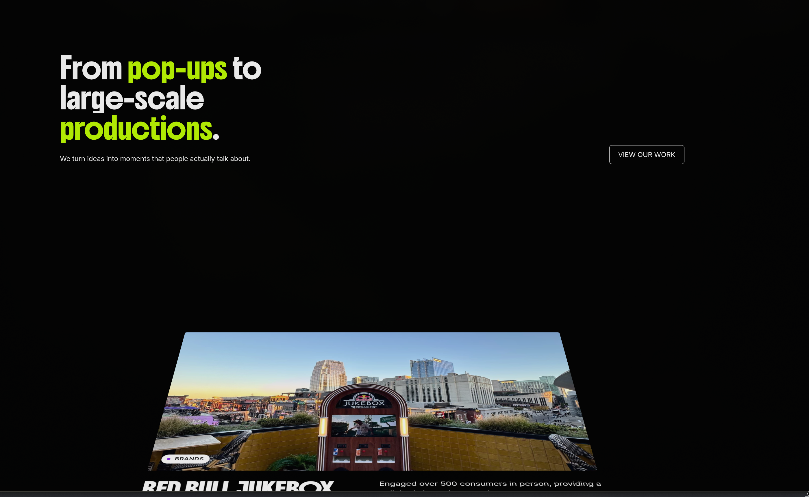
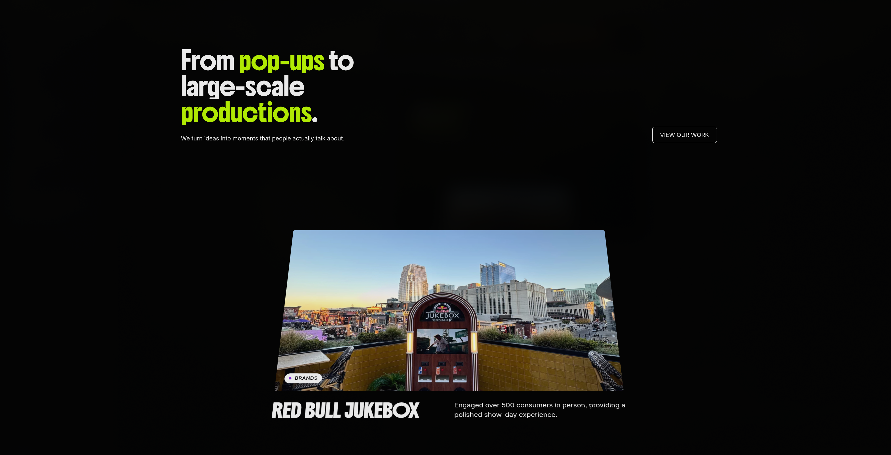
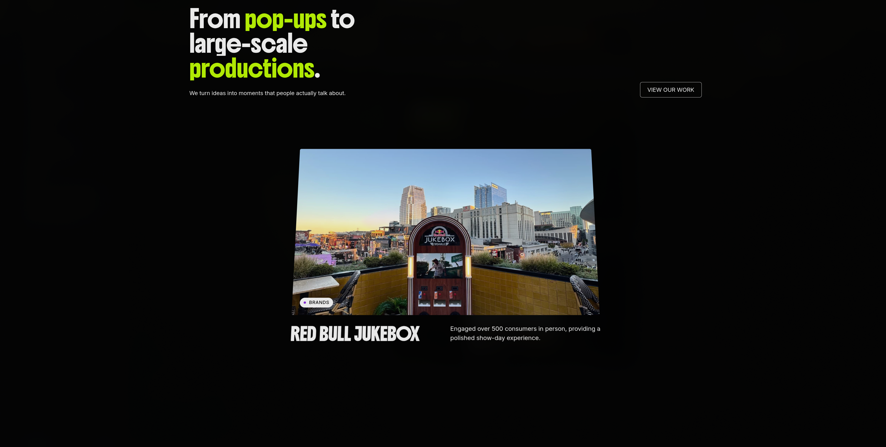
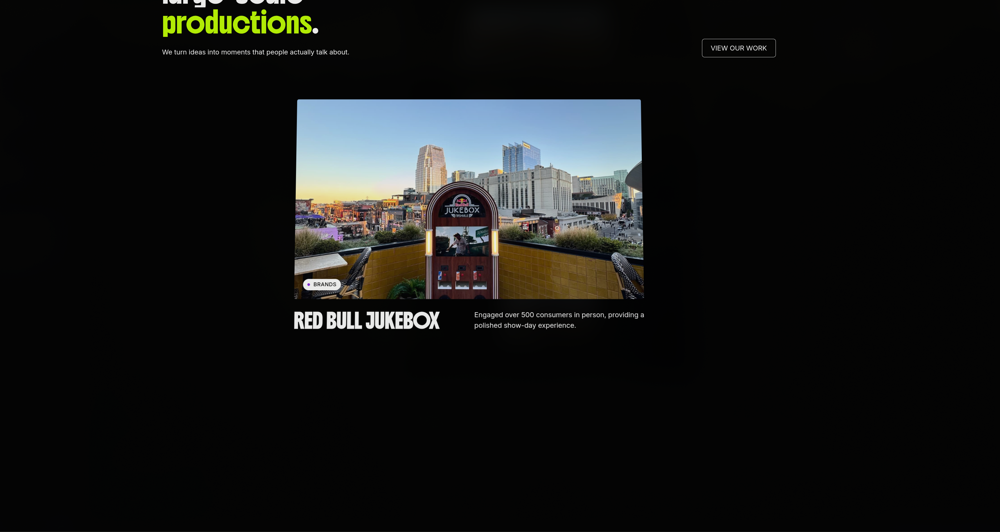

# Inspiración Visual y Referencias

Este documento guarda la inspiración visual utilizada para definir la dirección de arte de MisterFiestas. Para ver cómo se implementaron finalmente estas ideas en código, consulta el [Sistema de Diseño (Design System)](Design-System.md).

## Socios y Clientes

Esta referencia orienta la presentación de socios y clientes autorizados en la sección B2B/Empresas. Se busca un look limpio y en grillas.

## Referencias Generales y UI

1. 
   _Nota de implementación:_ De aquí se extrajo la paleta cálida (Cream, Peach, Orange) y el uso de tarjetas con bordes redondeados amplios (`border-radius: 30px`).
2. 
   _Nota de implementación:_ Inspiró el layout de navegación superior tipo píldora flotante (Glassmorphism) implementado en `.site-header`.
3. 
   _Nota de implementación:_ Referencia para la jerarquía tipográfica, el uso de "eyebrows" sobre los títulos principales y el contraste con fondos oscuros.
4. 
   _Nota de implementación:_ Destaca el tratamiento de micro-interacciones. Se planea usar `motion` para replicar animaciones sutiles al hacer scroll por el catálogo de servicios.
