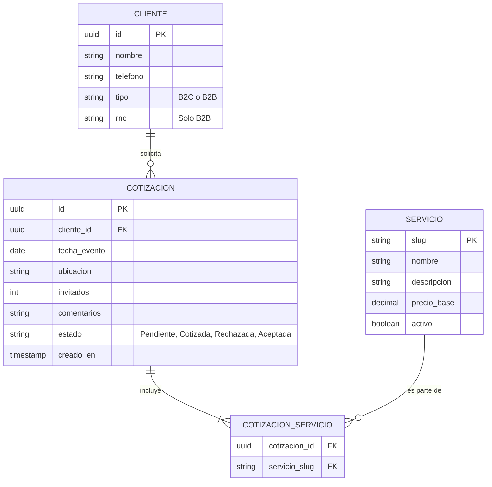

# Modelo de Datos

Este documento define la estructura conceptual de los datos manejados en la aplicación. Actualmente, la aplicación web no interactúa con una base de datos directamente, sino que define estas estructuras en TypeScript (en `src/types` y `src/schemas`) para asegurar integridad de datos.

## Entidades Principales

### 1. `Service` (Servicio)

Representa una oferta en el catálogo de MisterFiestas.
_Implementación actual:_ `src/types/service.ts`

| Campo         | Tipo     | Descripción                                                    |
| :------------ | :------- | :------------------------------------------------------------- |
| `slug`        | `string` | Identificador único amigable para URLs (ej. `tunel-infinito`). |
| `name`        | `string` | Nombre comercial del servicio.                                 |
| `description` | `string` | Descripción detallada para el usuario.                         |

_(Nota: Esta entidad crecerá cuando se integren los precios, fotos y capacidades documentados en el [Catálogo](01-Product/Catalog-and-Pricing.md))._

### 2. `QuoteRequest` (Solicitud de Cotización)

Representa los datos enviados por un cliente para solicitar un presupuesto.
_Implementación actual:_ Validado mediante `zod` en `src/schemas/quote.ts`

| Campo        | Tipo                | Descripción                                          |
| :----------- | :------------------ | :--------------------------------------------------- |
| `name`       | `string`            | Nombre del cliente solicitante.                      |
| `phone`      | `string`            | Teléfono de contacto.                                |
| `eventType`  | `string`            | Tipo de celebración (ej. Bodas, Cumpleaños).         |
| `eventDate`  | `string`            | Fecha en la que se realizará el evento.              |
| `location`   | `string`            | Provincia o ubicación específica (afecta logística). |
| `guestCount` | `number`            | Cantidad estimada de invitados.                      |
| `services`   | `string[]`          | Arreglo de slugs de los servicios seleccionados.     |
| `budget`     | `string` (opcional) | Rango de presupuesto estimado.                       |
| `comments`   | `string` (opcional) | Notas adicionales del cliente.                       |

## Diagrama Entidad-Relación (Futuro Backend)

El siguiente diagrama muestra la estructura relacional prevista para cuando se implemente el backend en Spring Boot y PostgreSQL.

